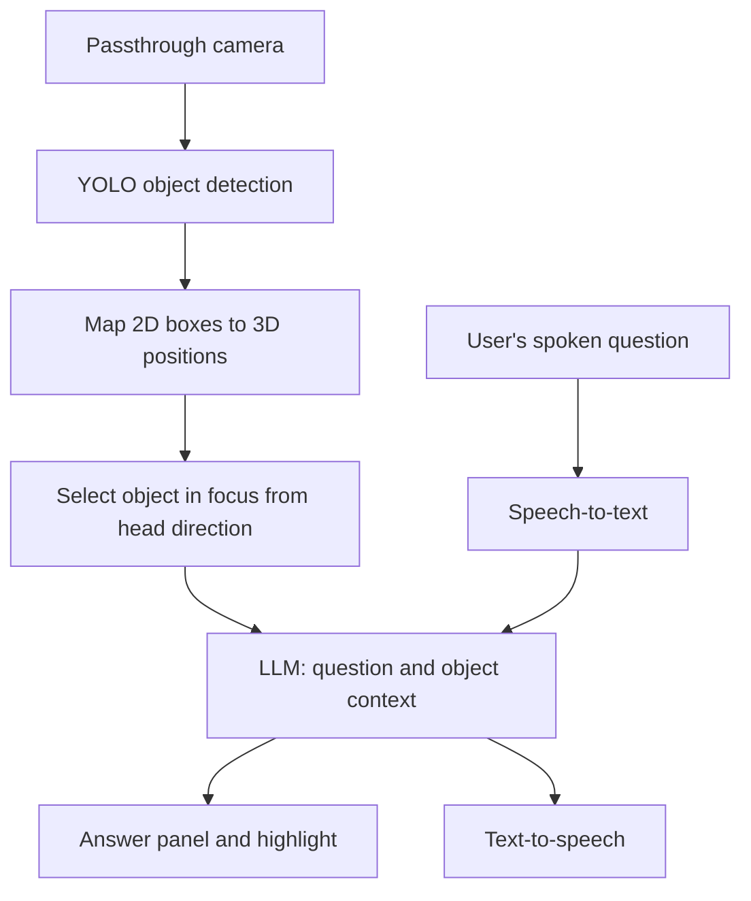

# What Am I Looking At?

A gaze-aware mixed reality assistant for Meta Quest. The user looks at a real-world object, asks a spoken question such as "What is that?" or "How does it work?", and receives an answer about that object without having to name it.

Group project for COMP6038 Advanced Interfaces, Oxford Brookes University, Semester 1, 2026-27.

> **Status:** Planning and design phase. No features are implemented yet. This README describes the planned system and will be updated as development progresses.

## Overview

Finding information about an unfamiliar object usually means stopping the task, describing the object in words and searching manually. This project removes that step by combining three things:

1. **Object detection.** A YOLO model detects real-world objects through the headset's passthrough camera.
2. **Head direction.** The system works out which detected object the user is looking at.
3. **Conversational AI.** The user asks a spoken question and the answer is generated in the context of that object.

## Planned features

| Feature | Requirement | Priority |
|---|---|---|
| Real-time object detection through the passthrough camera | FR1 | High |
| Bounding box and class label for each detected object | FR8, FR9 | High |
| Highlighting of the object the user is looking at | FR2 | High |
| Speech-to-text for spoken questions | FR3 | High |
| Answers generated in the context of the object in focus | FR4, FR12 | High |
| Answers presented as both text and voice | FR5 | Medium |
| Logging of latency and accuracy | FR7 | Medium |
| Locating another object of the same class | FR6 | Low |

## How it works



## Technology

| Component | Tool |
|---|---|
| Headset | Meta Quest |
| Engine | Unity (version to be confirmed) |
| XR framework | Meta XR SDK, Passthrough Camera API |
| On-device inference | Unity Inference Engine |
| Object detection | YOLO, pre-trained on COCO |
| Speech-to-text | To be decided |
| Conversational AI | To be decided |
| Text-to-speech | To be decided |
| Language | C# |

## Repository structure

Planned layout. Folders will be added as they are needed.

```
Assets/
  Scripts/
    Detection/      Object detection and 2D to 3D mapping
    Gaze/           Head direction and target selection
    Voice/          Speech-to-text and text-to-speech
    Conversation/   LLM requests and prompt building
    UI/             Highlighting and answer panel
    Logging/        Latency and accuracy measurements
  Scenes/
  Models/           YOLO model file
docs/               Requirements, backlog and meeting notes
```

## Getting started

Setup instructions will be added once the Unity project has been created.

Expected prerequisites:

- Unity Hub and the Unity version used by the team
- Android Build Support module for Unity
- A Meta Quest headset in developer mode

## API keys

Do not commit API keys to this repository.

Keys for external services are kept in a local file that is listed in `.gitignore`. Each team member creates this file on their own machine. Details will be added when the services are chosen.

## Team

| Name | Role |
|---|---|
| Soully | To be assigned |
| Clinton | To be assigned |
| Isik | To be assigned |
| Vedat  | To be assigned |

## Use of AI tools

In line with the module's AI policy, any AI-assisted code in this repository is labelled in the source file with a comment stating which tool was used and for what purpose. A summary is kept here.

## References

- Meta Passthrough Camera API: https://developers.meta.com/horizon/documentation/unity/unity-pca-documentation/
- Meta Passthrough Camera API samples: https://github.com/oculus-samples/Unity-PassthroughCameraApiSamples
- COCO dataset: https://cocodataset.org/
