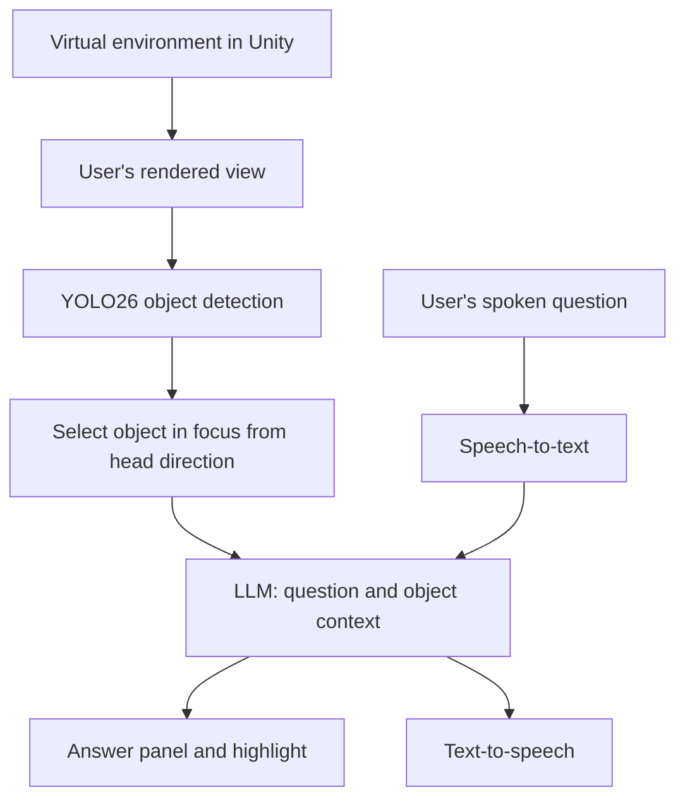

# What Am I Looking At?

A gaze-aware virtual reality assistant for Meta Quest. The user looks at an object in a virtual environment, asks a spoken question such as "What is that?" or "How does it work?", and receives an answer about that object without having to name it.

Group project for COMP6038 Advanced Interfaces, Oxford Brookes University, Semester 1, 2026-27.

> **Status:** Planning and design phase. No features are implemented yet. This README describes the planned system and will be updated as development progresses.

## Overview

In a virtual environment, users can see objects but often have no quick way to find out what they are or how they work. This project addresses that by combining three things:

1. **Object detection.** A YOLO26 model detects objects in the user's rendered view of the virtual environment.
2. **Head direction.** The system works out which detected object the user is looking at.
3. **Conversational AI.** The user asks a spoken question and the answer is generated in the context of that object.

Because the environment is built in Unity, the identity and position of every object are known to the engine. This ground truth is used to measure how accurately the detection model performs.

## Planned features

| Feature | Requirement | Priority |
|---|---|---|
| Real-time object detection in the virtual environment | FR1 | High |
| Bounding box and class label for each detected object | FR8, FR9 | High |
| Highlighting of the object the user is looking at | FR2 | High |
| Speech-to-text for spoken questions | FR3 | High |
| Answers generated in the context of the object in focus | FR4, FR12 | High |
| Answers presented as both text and voice | FR5 | Medium |
| Logging of latency and accuracy | FR7 | Medium |
| Locating another object of the same class | FR6 | Low |

## How it works



## Technology

| Component | Tool |
|---|---|
| Headset | Meta Quest |
| Engine | Unity (version to be confirmed) |
| XR framework | Meta XR SDK |
| On-device inference | Unity Inference Engine |
| Object detection | YOLO26 |
| Speech-to-text | To be decided |
| Conversational AI | To be decided |
| Text-to-speech | To be decided |
| Language | C# |

## Repository structure

Planned layout. Folders will be added as they are needed.

```
Assets/
  Scripts/
    Detection/      Object detection on the rendered view
    Gaze/           Head direction and target selection
    Voice/          Speech-to-text and text-to-speech
    Conversation/   LLM requests and prompt building
    UI/             Highlighting and answer panel
    Logging/        Latency and accuracy measurements
  Scenes/           Virtual environment
  Models/           YOLO26 model file
docs/               Requirements, backlog and meeting notes
```

## Getting started

Setup instructions will be added once the Unity project has been created.

Expected prerequisites:

- Unity Hub and the Unity version used by the team
- Android Build Support module for Unity
- A Meta Quest headset in developer mode

## API keys

Do not commit API keys to this repository.

Keys for external services are kept in a local file that is listed in `.gitignore`. Each team member creates this file on their own machine. Details will be added when the services are chosen.

## Team

| Name | Development responsibility | Design Report section |
|---|---|---|
| Soully Traore | Setting up the virtual world | Background Research and Use Case |
| Isik Tozan | Setting up the virtual world | Implementation Pathway |
| Clinton | Gathering datasets | Task Outline |
| Vedat Yildirim | Gathering datasets | Technology and Tools |

All members contribute to coding during the sprints.

## Future work

The detection pipeline works on images, so it could later be extended to mixed reality by using the Meta Quest passthrough camera to detect real-world objects.

## Use of AI tools

In line with the module's AI policy, any AI-assisted code in this repository is labelled in the source file with a comment stating which tool was used and for what purpose. A summary is kept here.

| File | Tool | Purpose |
|---|---|---|
| README.md | Claude | Initial draft, reviewed and edited by the team |

## References

- Ultralytics YOLO documentation: https://docs.ultralytics.com/
- Meta XR SDK for Unity: https://developers.meta.com/horizon/documentation/unity/
